# Web Signer Flow

Browser-based transaction signing for the Printr MCP agent. Allows a user to sign a token creation transaction using their own wallet (MetaMask, Phantom, etc.) without ever exposing a private key to the agent.

---

## Overview

Three system boundaries interact: the MCP process (agent + local session server), the user's browser (sign page + wallet), and the target blockchain.

```mermaid
flowchart LR
    classDef mcp     fill:#0f2744,stroke:#60a5fa,color:#bfdbfe
    classDef browser fill:#052e16,stroke:#4ade80,color:#bbf7d0
    classDef ext     fill:#1e1b4b,stroke:#a78bfa,color:#ddd6fe

    subgraph mcpBox["🖥  MCP Process"]
        direction TB
        agent(["🤖  Agent"]):::mcp
        session["🗄  Session Server"]:::mcp
        agent <-->|"session lifecycle"| session
    end

    subgraph browserBox["🌐  Browser"]
        direction TB
        page["📄  Sign Page"]:::browser
        wallet(["🔑  Wallet"]):::browser
        page <-->|"request signature"| wallet
    end

    chain[("⛓  Blockchain")]:::ext
    api["☁️  Printr API"]:::ext

    agent      -->|"sign URL"| browserBox
    browserBox <-->|"session API"| session
    wallet     -->|"broadcast tx"| chain
    agent      -->|"poll deployments"| api
```



---

## Components

### MCP Server — `printr_open_web_signer` tool

**Source:** [src/tools/open-web-signer.ts](../src/tools/open-web-signer.ts)

Accepts the unsigned payload from `printr_create_token` and:

1. Lazily starts the [session HTTP server](#session-http-server) (idempotent — port reused if already bound)
2. Creates an in-memory signing session with a UUID token and 30-minute TTL
3. Returns a deep link: `{PRINTR_APP_URL}/sign?session={token}&api={encodedLocalUrl}`

**Input schema:**

| Field | Type | Required | Description |
|---|---|---|---|
| `chain_type` | `"evm" \| "svm"` | Yes | Chain family of the unsigned transaction |
| `payload` | `object` | Yes | Full unsigned tx payload from `printr_create_token` |
| `token_id` | `string` | Yes | Telecoin ID (hex) |
| `token_meta` | `object` | No | Token preview data (name, symbol, description, image_url) |
| `rpc_url` | `string` | No | RPC endpoint override for the signing page |

**Output:**

| Field | Type | Description |
|---|---|---|
| `url` | `string` | Deep link to open in the browser |
| `session_token` | `string` | UUID session token |
| `api_port` | `number` | Port of the local session API |
| `expires_at` | `number` | Epoch ms — 30 min from creation |

---

### Session HTTP Server

**Source:** [src/server/](../src/server/)

A minimal [Hono](https://hono.dev) HTTP server started on demand inside the MCP process. Binds to `127.0.0.1` on the first free port in the range **5174–5200**.

The server is a singleton — calling `startSessionServer()` multiple times always returns the same port.

#### Endpoints

| Method | Path | Description |
|---|---|---|
| `GET` | `/health` | Liveness check — returns `{ ok: true }` |
| `POST` | `/sessions` | Create a session (internal use) |
| `GET` | `/sessions/:token` | Fetch session by token |
| `PUT` | `/sessions/:token/result` | Write signing result |

All responses are JSON. All routes include `Access-Control-Allow-Origin: *`.

#### `GET /sessions/:token`

Returns the full `TxSession` object on success.

| Status | Condition |
|---|---|
| `200` | Session found and not expired |
| `404` | Token not found |
| `410` | Session found but TTL exceeded (evicted on read) |

#### `PUT /sessions/:token/result`

**Request body (`TxResult`):**

```ts
{
  status: "success" | "failed";
  tx_hash?: string;      // EVM — transaction hash
  signature?: string;    // SVM — transaction signature (base58)
  error?: string;        // Present when status === "failed"
  image_data?: string;   // Optional base64 image if user replaced the token image
}
```

---

### Session Data Model

**Source:** [src/server/sessions.ts](../src/server/sessions.ts)

Sessions are stored in a `Map<string, TxSession>` for the lifetime of the MCP process. There is no persistence — sessions are lost if the process restarts.

```ts
type TxSession = {
  token: string;          // UUID
  chain_type: "evm" | "svm";
  payload: unknown;       // EVM or SVM unsigned tx payload
  token_id: string;       // Telecoin hex ID
  token_meta?: {
    name: string;
    symbol: string;
    description?: string;
    image_url?: string;   // CDN URL or base64 data URL
  };
  rpc_url?: string;
  created_at: number;     // epoch ms
  expires_at: number;     // created_at + 30 min
  result?: TxResult;      // populated after signing
};
```

---

## Sequence Diagram

```mermaid
sequenceDiagram
    participant Agent as Agent / MCP
    participant Session as Session Server
    participant Page as Sign Page
    participant Wallet as Wallet
    participant Chain as Blockchain

    rect rgb(20, 40, 70)
        Note over Agent,Session: 1 · Session Setup
        Agent->>Session: startSessionServer() — idempotent, port 517x
        Agent->>Session: createSession(payload, token_id, token_meta, …)
        Session-->>Agent: { token: UUID, expires_at: +30 min }
        Note over Agent: deep link = PRINTR_APP_URL/sign?session=TOKEN&api=localhost:PORT
    end

    Agent-->>Page: presents deep link URL to user

    rect rgb(20, 60, 50)
        Note over Page,Session: 2 · Page Load
        Page->>Session: GET /sessions/TOKEN
        Session-->>Page: TxSession { chain_type, payload, token_meta, rpc_url }
        Note over Page: render token preview card (name, symbol, image)
    end

    rect rgb(60, 40, 20)
        Note over Page,Chain: 3 · Sign & Broadcast
        Page->>Wallet: connect (EVM → MetaMask · SVM → Phantom)
        Wallet-->>Page: connected
        Page->>Wallet: sign transaction
        Wallet->>Chain: sendRawTransaction
        Chain-->>Wallet: tx hash / signature
        Wallet-->>Page: confirmed
    end

    rect rgb(50, 20, 60)
        Note over Page,Session: 4 · Result
        Page->>Session: PUT /sessions/TOKEN/result { status, tx_hash/signature, image_data? }
        Session-->>Page: { ok: true }
        Note over Page: show trade page link → PRINTR_APP_URL/trade/TOKEN_ID
    end

    Note over Agent: poll printr_get_deployments(token_id)
```



---

## URL Structure

```
{PRINTR_APP_URL}/sign?session={UUID}&api={encodeURIComponent("http://localhost:{PORT}")}
```

| Part | Example | Source |
|---|---|---|
| `PRINTR_APP_URL` | `https://app.printr.money` | `PRINTR_APP_URL` env var (default) |
| `session` | `a1b2c3d4-…` | UUID generated by `createSession()` |
| `api` | `http%3A%2F%2Flocalhost%3A5174` | URL-encoded local server base URL |

The web app extracts both query params and uses them to fetch the session and submit the result — it has no knowledge of the MCP process or the `PRINTR_APP_URL` env var.

---

## EVM Payload

```ts
{
  to: string;        // CAIP-10 — "eip155:{chainId}:{address}"
  calldata: string;  // hex-encoded
  value: string;     // wei as decimal string
  gas_limit: number;
}
```

The sign page parses the chain ID from the `to` field, switches the connected wallet to that chain, then calls `walletClient.sendTransaction(...)`.

## SVM Payload

```ts
{
  ixs: Array<{
    program_id: string;                                       // base58
    accounts: Array<{ pubkey: string; is_signer: boolean; is_writable: boolean }>;
    data: string;                                             // base64
  }>;
  lookup_table?: string;   // optional ALT address (base58)
  mint_address: string;    // CAIP-10 — "solana:{genesis}:{pubkey}"
}
```

The sign page reconstructs a `VersionedTransaction` from the instructions, resolves the optional address lookup table, fetches a recent blockhash, signs with the connected Solana wallet, and broadcasts via `sendRawTransaction`.

---

## Security Properties

| Property | Detail |
|---|---|
| **No private key exposure** | The user signs with their own browser wallet — the agent never sees the key |
| **localhost-only API** | The session server binds to `127.0.0.1` only; not reachable from outside the machine |
| **Short TTL** | Sessions expire after 30 minutes and are evicted on next read |
| **No persistence** | Session data exists only in the MCP process memory — gone on restart |
| **CORS wildcard** | Required so the HTTPS sign page can `fetch` from `http://localhost`; acceptable because the server is localhost-only |

---

## Local Development

To test the sign page against a local web dev server, use the stub session script:

```sh
# SVM session (default)
bun run dev:stub-sign-session

# EVM session (Base)
bun run dev:stub-sign-session --evm
```

Override the app base URL via env var:

```sh
PRINTR_APP_URL=http://localhost:3000 bun run dev:stub-sign-session
```

The script starts the session server, creates a session with realistic mock payloads and a pre-fetched base64 token image, and prints the full sign URL to stdout.
