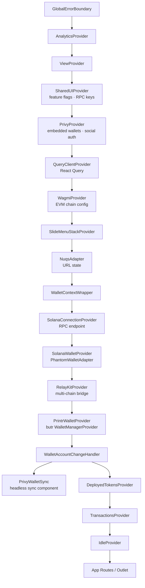
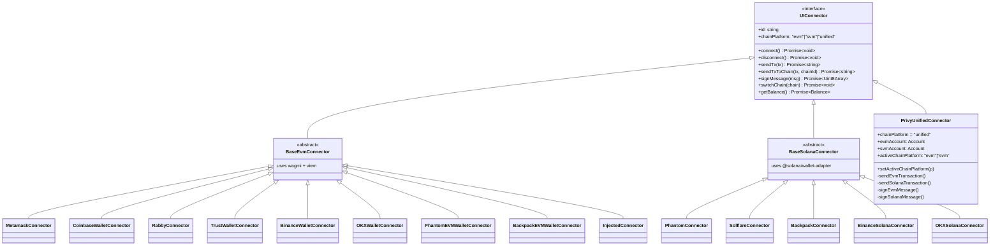
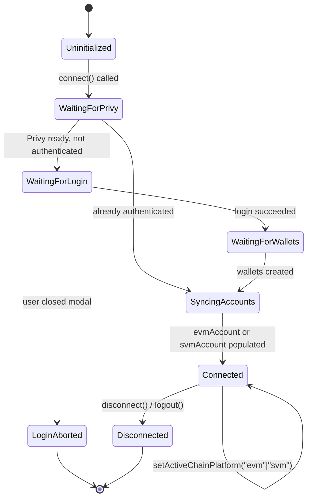
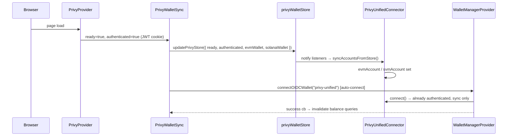
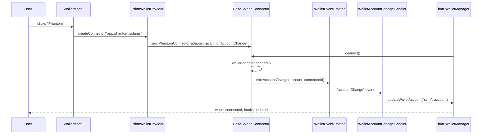
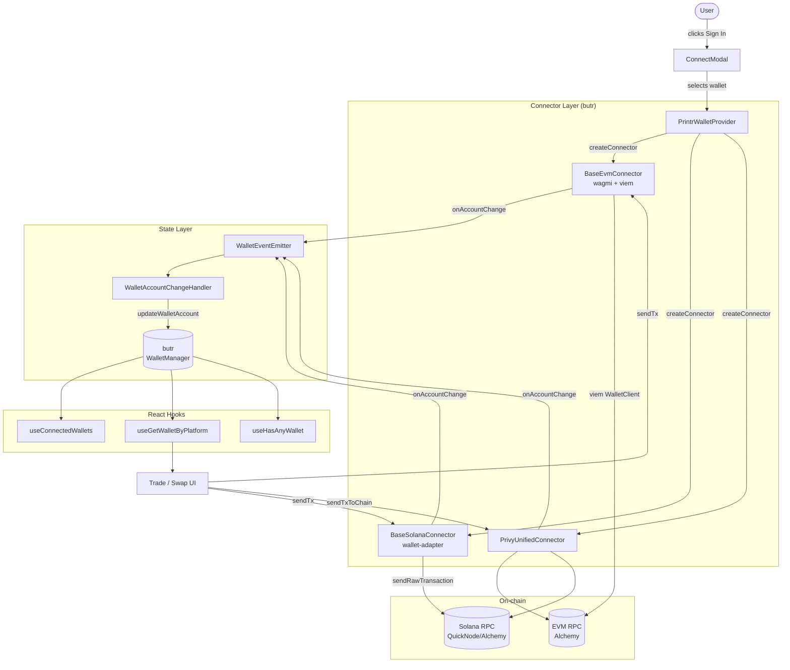

# Wallet Interaction Stack

Technical reference for how the Printr web app connects, manages, and transacts with both EVM and SVM wallets.

---

## Table of Contents

1. [Library Dependencies](#library-dependencies)
2. [Provider Hierarchy](#provider-hierarchy)
3. [Connector Architecture](#connector-architecture)
4. [Privy Unified Connector](#privy-unified-connector)
5. [State Synchronisation Flow](#state-synchronisation-flow)
6. [Chain Configuration](#chain-configuration)
7. [Key Hooks](#key-hooks)
8. [Data Flow](#data-flow)

---

## Library Dependencies

### EVM

| Library | Version | Role |
|---|---|---|
| `wagmi` | v3.3.2 | React hooks for EVM wallet connections |
| `viem` | v2.44.4 | Low-level EVM transaction building / signing |
| `@wagmi/core` | v2.22.1 | Framework-agnostic wagmi core |
| `@walletconnect/ethereum-provider` | v2.23.2 | WalletConnect v2 (QR + deep-link) |
| `@coinbase/wallet-sdk` | v4.3.7 | Coinbase Wallet SDK |
| `@binance/w3w-wagmi-connector-v2` | — | Binance Web3 Wallet wagmi connector |

### SVM (Solana)

| Library | Version | Role |
|---|---|---|
| `@solana/wallet-adapter-react` | v0.15.39 | React context + hooks for Solana wallets |
| `@solana/wallet-adapter-base` | v0.9.27 | Adapter interface / base class |
| `@solana/wallet-adapter-phantom` | v0.9.28 | Phantom adapter |
| `@solana/wallet-adapter-solflare` | v0.6.32 | Solflare adapter |
| `@solana/wallet-adapter-backpack` | v0.1.14 | Backpack adapter |
| `@solana/web3.js` | v1.98.4 | Solana RPC and transaction primitives |
| `@solana/kit` | v5.5.1 | Solana utility kit |

### Embedded Wallets & Auth

| Library | Version | Role |
|---|---|---|
| `@privy-io/react-auth` | v3.12.0 | Embedded wallets + social login (Google) |
| `@privy-io/react-auth/solana` | — | Privy Solana wallet hooks |
| `@privy-io/wagmi` | v4.0.0 | Privy ↔ wagmi adapter |

### Cross-chain Bridge

| Library | Role |
|---|---|
| `@relayprotocol/relay-sdk` | Multi-chain bridge SDK + chain registry |
| `@relayprotocol/relay-kit-ui` | Relay UI components |
| `@relayprotocol/relay-svm-wallet-adapter` | Relay ↔ Solana wallet-adapter bridge |

### Wallet Management Abstraction

| Library | Role |
|---|---|
| `butr` | Internal wallet manager. Provides `WalletManagerProvider`, `UIConnector` interface, and all wallet hooks. |

---

## Provider Hierarchy

The full React provider tree, from outermost to innermost, as rendered in [`root.tsx`](../app/root.tsx):



**Key design decisions:**

- `PrivyProvider` wraps `WagmiProvider` so Privy's wagmi adapter can override the wagmi store.
- `WalletContextWrapper` is the single assembly point for both EVM and SVM providers before `butr` takes over.
- `PrivyWalletSync` is a **headless** component (returns `null`) that bridges Privy React hooks into the plain-object `privyWalletStore`.

---

## Connector Architecture

### UIConnector Interface (from `butr`)

All connectors implement a common interface regardless of chain:

```typescript
interface UIConnector {
  id: string
  name: string
  iconUrl: string
  chainPlatform: "evm" | "svm" | "unified"

  connect(): Promise<void>
  disconnect(): Promise<void>
  getAccount(): Promise<Account | null>
  signMessage(msg: Uint8Array): Promise<Uint8Array>
  sendTx(tx): Promise<string>
  sendTxToChain(tx, chainId): Promise<string>
  switchChain(chain): Promise<void>
  getTransactionReceipt(txHash): Promise<{ status: "Success" | "Error" | "Pending" }>
  getBalance(mint?): Promise<Balance>
  getSigner(): Promise<WalletClient | null>
}
```

### Connector Tree



### Connector Registration

Connectors are registered as static `ConnectorMetadata[]` in two index files and assembled in [`WalletContext.tsx`](../app/contexts/WalletContext.tsx):

```
ALL_CONNECTORS = [...EVM_CONNECTORS, ...SOLANA_CONNECTORS, PRIVY_CONNECTOR]
```

`PrintrWalletProvider` passes a `createConnector(id)` factory to `WalletManagerProvider`. Instances are cached by ID after first creation. The Privy unified connector is conditionally excluded when the `ENABLE_SMART_WALLETS` feature flag is off.

---

## Privy Unified Connector

The `PrivyUnifiedConnector` ([`unified-connector.ts`](../app/features/wallet/connectors/privy/unified-connector.ts)) is the embedded/smart wallet path. It handles **both** EVM and SVM from a single `chainPlatform: "unified"` connector.

### Internal State Machine



### Transaction Routing

`sendTxToChain(tx, targetChainId)` inspects the CAIP-2 chain ID prefix to route the transaction:

```mermaid
flowchart LR
    A[sendTxToChain] --> B{chainId starts\nwith eip155:?}
    B -- Yes --> C[activeChainPlatform = evm]
    B -- No --> D[activeChainPlatform = svm]
    C --> E[sendEvmTransaction\nviem WalletClient]
    D --> F[sendSolanaTransaction\n@solana/web3.js]
    E --> G[tx hash]
    F --> G
```

### `privyWalletStore` – non-React bridge

[`wallet-store.ts`](../app/features/wallet/connectors/privy/wallet-store.ts) is a plain mutable object with a simple pub-sub mechanism. It lets the class-based `PrivyUnifiedConnector` access Privy state without being inside React's render tree.

```
┌──────────────────────────────────────────────────────┐
│  PrivyWalletSync (React component)                   │
│  reads: usePrivy, useWallets, useSolanaWallets,      │
│         useSignMessage, useSignTransaction           │
│  writes → updatePrivyStore(...)                      │
└───────────────────────┬──────────────────────────────┘
                        │ notifies listeners
                        ▼
┌──────────────────────────────────────────────────────┐
│  privyWalletStore (plain object)                     │
│  { evmWallet, solanaWallet, login, logout,           │
│    signMessageHook, signTransactionHook,             │
│    ready, authenticated, loginAborted }              │
└───────────────────────┬──────────────────────────────┘
                        │ subscribeToPrivyStore
                        ▼
┌──────────────────────────────────────────────────────┐
│  PrivyUnifiedConnector (class)                       │
│  syncAccountsFromStore() on every store change       │
└──────────────────────────────────────────────────────┘
```

---

## State Synchronisation Flow

### Session restore after page refresh



### External wallet connection (e.g. Phantom SVM)



---

## Chain Configuration

### EVM – wagmi ([`wagmiConfig.ts`](../app/configs/wagmiConfig.ts))

| Chain | Chain ID | RPC (Alchemy preferred) |
|---|---|---|
| Ethereum Mainnet | 1 | `eth-mainnet.g.alchemy.com` |
| Arbitrum | 42161 | `arb-mainnet.g.alchemy.com` |
| Base | 8453 | `base-mainnet.g.alchemy.com` |
| BSC | 56 | `bnb-mainnet.g.alchemy.com` |
| Avalanche | 43114 | `avax-mainnet.g.alchemy.com` |
| Mantle | 5000 | `mantle-mainnet.g.alchemy.com` |
| Monad Testnet | 10143 | `monad-testnet.g.alchemy.com` |
| Monad Mainnet | 143 | `rpc.monad.xyz` (custom) |

Transports fall back to the chain's default public RPC when no Alchemy key is available.

### SVM – Solana

The RPC endpoint is resolved at runtime:

```
Alchemy: https://solana-mainnet.g.alchemy.com/v2/{ALCHEMY_API_KEY}
Fallback: https://api.mainnet-beta.solana.com
QuickNode: window.ENV.QUICKNODE_RPC_ENDPOINT_URL  (passed to SVM connectors)
```

### Non-EVM chains (Relay)

`WalletContextWrapper` fetches the Relay Protocol chain registry on mount (`fetchNonEvmChains()`). The combined list of EVM chains (converted from wagmi) and Relay non-EVM chains is passed to `RelayKitProvider`.

---

## Key Hooks

All hooks listed below are exported from `butr` unless noted otherwise.

### Wallet state

```typescript
// All currently connected wallets (can be 0–3: evm, svm, unified)
useConnectedWallets(): ConnectedWallet[]

// Wallet for a specific platform
useGetWalletByPlatform(platform: "evm" | "svm"): ConnectedWallet | undefined

// Map keyed by platform
useConnectedWalletsMapByPlatform(): Record<ChainPlatform, ConnectedWallet | undefined>

// Whether any wallet is connected
useHasAnyWallet(): boolean

// Connection mode: "external-wallet" | "oidc" | null
useWalletMode(): WalletMode
```

### Wallet actions

```typescript
// Connect a connector by ID (regular)
useConnectWallet(): (connectorId: string) => Promise<void>

// Connect via OIDC (used for Privy smart wallet auto-connect)
useConnectOIDCWallet(): (connectorId, onSuccess?, onError?) => Promise<void>

// Update the active account for a platform (e.g. on account switch)
useUpdateWalletAccount(): (platform, account) => void

// Reset all wallet state and clear auth token
useResetWallet(): () => void
```

### Balance hooks (app-level)

```typescript
// web/app/hooks/use-wallet-balance.ts
useWalletBalanceForPlatform({
  chainPlatform: "evm" | "svm",
  disabled?: boolean,
  tokenAddress?: string,
}): { balance: Balance | undefined; isLoading: boolean }

// web/app/hooks/use-get-wallet-balances.ts
useGetWalletBalances(
  walletAddress: string,
  chainIds: number[],
  tokenAddresses: string[],
): UseQueryResult<TokenBalance[]>
```

---

## Data Flow

End-to-end view from user action to on-chain transaction:



### Analytics side-effects

`WalletAccountChangeHandler` fires PostHog + Sentry identification on every wallet state change:

```
wallets change → identifyUser({ evmWallet, svmWallet, unifiedWallet })
              → setSentryWallet(...)
              → trackWalletConnected(connectorId, platform, address, chainId)
```

---

## Notable Quirks

### Phantom EVM conflict prevention

On desktop (non-mobile, non-Phantom browser), `WalletContextWrapper` sets `localStorage["wagmi.phantom.disconnected"] = "true"` on mount. This prevents wagmi from auto-connecting Phantom's EVM provider, reserving Phantom as a pure SVM wallet. The flag is skipped in the Phantom in-app browser where EVM is the expected mode.

### Connector ID normalisation

The Binance wallet changed its connector ID between SDK versions (`com.binance.wallet` → `wallet.binance.com`). `normalizeEvmConnectorId()` maps legacy IDs to canonical IDs before looking up cached connector instances, ensuring persisted wallet state from localStorage continues to work after upgrades.

### Privy auto-connect guard

`PrivyWalletSync` uses a `hasAutoConnectedRef` guard and a 20-second watchdog timer to prevent infinite auto-connect loops. If the auto-connect attempt fails or the watchdog fires without a connected wallet, the ref is reset so the next Privy state change can trigger a retry.
